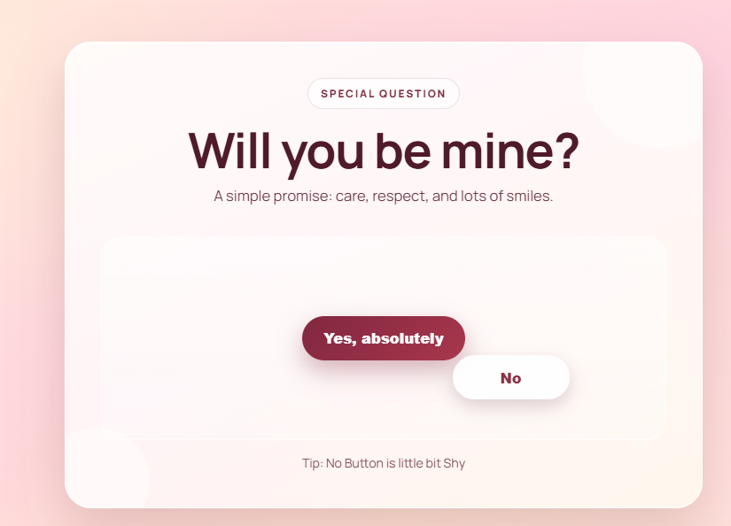
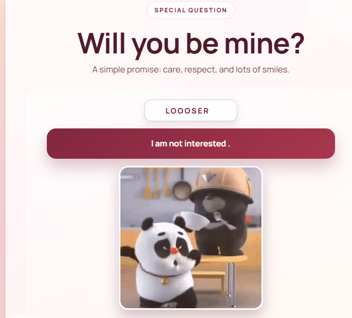

# 💖 Proposal Website

A fun and interactive React web app that asks a proposal-style question with playful UI, animations, and surprise effects.

---

## 🚀 Preview

### 💌 Home Screen



### 😅 Reject Screen



---

## ✨ Features

* 💌 Interactive proposal UI
* 😅 Moving **"No" button** (hard to click 😄)
* ❤️ "Yes" flow with:

  * Typing animation
  * Confetti-style effect
  * Dancing panda GIF 🐼
* 👻 Surprise scary overlay with sound
* 📱 Fully responsive

---

## 🛠️ Tech Stack

* React (Vite)
* JavaScript
* CSS (animations)
* ESLint

---

## 📁 Project Structure

```text
propsal-website/
│── public/
│   ├── ghost.mp3
│   ├── panda_dance.gif
│   ├── scary.gif
│
│── src/
│   ├── assets/
│   ├── App.jsx
│   ├── App.css
│   ├── main.jsx
│
│── screenshot/
│   ├── homescreen.png
│   ├── panda.png
│
│── index.html
│── package.json
│── README.md
```

---

## ⚙️ Getting Started

### 📌 Prerequisites

* Node.js (18+)
* npm

---

### 📥 Installation

```bash
cd propsal-website
npm install
```

---

### ▶️ Run Development Server

```bash
npm run dev
```

Open 👉 http://localhost:5173

---

## 📜 Available Scripts

* `npm run dev` → Start server
* `npm run build` → Production build
OAOAOA* `npm run preview` → Preview build
OAOAOA* `npm run lint` → Lint code

---
OAOAOA
## 🎨 Customization

OAOAOA* Edit UI → `src/App.jsx`
* Change styles → `src/App.css`
* Replace media → `public/`

---

## 🚀 Deployment

Deploy on:

* Vercel
* Netlify
* GitHub Pages

```bash
npm run build
```

Output folder: `dist/`

OAOAOA---
OAOAOAOAOAOAOAOAOA
## 🙌 Author

OAOAOA**Darshan**

---

⭐ If you like this project, give it a star!

